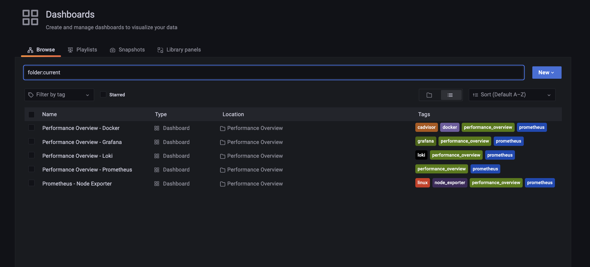
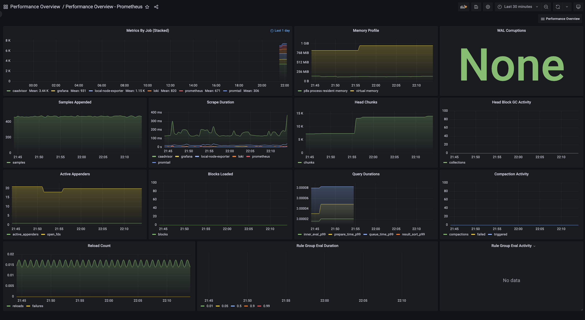

# Metrics Stack

Installs and configures the following services to work together:

- [Grafana](https://grafana.com/)
- [Prometheus](https://prometheus.io/)
- [Loki](https://grafana.com/docs/loki/latest/)
- [Promtail](https://grafana.com/docs/loki/latest/clients/promtail/)
- [syslog-ng](https://www.syslog-ng.com/)
- [snmp_exporter](https://github.com/prometheus/snmp_exporter)
- [node_exporter](https://github.com/prometheus/node_exporter)
- [cAdvisor](https://github.com/google/cadvisor)


One line explanation of each service does:

- **Grafana**: Visualising your metrics in dashboards. Sources data from many datasources (eg. Prometheus, Loki, InfluxDB)
- **Prometheus**: Collecting metric data
- **Loki**: Collecting metric data related to logs
- **Promtail**: Log agent that sends logs to Loki in a format it can parse
- **syslog-ng**: Syslog forwarder (sends logs to Promtail)
- **node_exporter**: Exposes a system's metrics (cpu, ram, network, disc etc) to Prometheus
- **snmp_exporter**: Forwards SNMP traffic from SNMP devices to Promethues
- **cAdvisor**: Sends Docker container metrics to Prometheus

*This repo is inspired by the excellent work done in* [grafana-loki-syslog-aio](https://github.com/lux4rd0/grafana-loki-syslog-aio).

## Running

Start up the stack with:

```
docker-compose up -d --force-recreate
```

## Login

The default login is `admin`/`admin`. You can change the password to whatever you like after that.

## Preconfigured Dashboards

There are five preconfigure performance metrics Dashboards:

- Docker
- Grafana
- Loki
- Prometheus
- Node Exporter





The Prometheus dashboard as an example:





To add custom configuration you need to update the appropriate config files as outlined below.

### Prometheus

Add your custom scrapers:


```yaml
#prometheus/config/prometheus.yml
 - job_name: 'your_job_name'
   static_configs:
   - targets: ['target_id:port'] # endpoint running /metrics
```

For example, to get metrics from a [node_exporter](https://github.com/prometheus/node_exporter) running on `192.168.1.50` add the following to `prometheus/config/prometheus.yml`:

```
- job_name: 'my-node-exporter'
  static_configs:
  - targets: ['192.168.1.50:9100']
```

See [The Prometheus Configuration Documentation](https://prometheus.io/docs/prometheus/latest/configuration/configuration/) for more examples.

### SNMP Exporter

To register your [SNMP](https://en.wikipedia.org/wiki/Simple_Network_Management_Protocol) stats:
1. Enable SNMP functionality on your device
1. Configure your community name for your SNMP community
1. Add the community name to `snmp-exporter/config/snmp.yml`:


```yaml
#snmp-exporter/config/snmp.yml
  auth:
    community: <your community name>
```


Then add the following section to your `prometheus/config/prometheus.yml`:

```
 - job_name: 'snmp-exporter'
   static_configs:
   - targets: ['<target_ip_1>']
     labels:
       job: '<your_label_1>'
   - targets: ['<target_ip_2>']
     labels:
       job: 'your_label_2'
   metrics_path: /snmp
   params:
     module: [if_mib] # Name of snmp module. If you generated your own snmp.yml file then use the name of that module here.
   relabel_configs:
     - source_labels: [__address__]
       target_label: __param_target
     - source_labels: [__param_target]
       target_label: instance
     - target_label: __address__
       replacement: <host ip running snmp_exporter>:9116  # The SNMP exporter's real hostname:port.
```

### Links
 - [An Advanced Guide to Network Monitoring with Grafana and Prometheus](https://grafana.com/blog/2022/02/01/an-advanced-guide-to-network-monitoring-with-grafana-and-prometheus/)
- [Step-By-Step Guide to Connecting Prometheus to pfsense via Snmp](https://brendonmatheson.com/2021/02/07/step-by-step-guide-to-connecting-prometheus-to-pfsense-via-snmp.html)

## Syslogs

To forward syslogs to syslog-ng, set the following as the syslog server in the source device:
`<host ip running syslog-ng>:514` or `<host ip running syslog-ng>:601` depending on what your device supports.


## General Information

To test any service exposing metrics to Promethues, you can query there `/metrics` endpoint.

For example to query your Grafana metrics hit: `http://<host ip running grafan>:3000/metrics`

## Service Endpoints

| Service | HTTP Ports | Other Ports |
| ------- | ---- | ---- |
| Grafana| [Web](http://localhost:3000), [Metrics](http://localhost:3000/metrics) | - |
| Prometheus| [Web](http://localhost:9090), [Metrics](http://localhost:9090/metrics) | - |
| Loki| [Web](http://localhost:3100/ready), [Metrics](http://localhost:3100/metrics) | - |
| Promtail| [Web](http://localhost:9080), [Metrics](http://localhost:9080/metrics) | tcp 1514 |
| node_exporter| [Web](http://localhost:9100/), [Metrics](http://localhost:9100/metrics) | - |
| cAdvisor| [Web](http://localhost:8080/), [Metrics](http://localhost:8080/metrics) | - |
| snmp_exporter| [Web](http://localhost:9116/), [Metrics](http://localhost:9116/metrics) | - |
| syslog-ng| - | udp 514, tcp 601 |


## Issues

If you run this stack as a non-root user (for example on Linux), you can run into permission issues such as:

> mkdir: can't create directory '/var/lib/grafana/plugins': Permission denied
> GF_PATHS_DATA='/var/lib/grafana' is not writable.

This will be evident when you run `docker ps` and see Grafana continuously restarting. You can have a look at its logs
via `docker logs grafana`


This is because Grafana [expects](https://grafana.com/docs/grafana/latest/setup-grafana/installation/docker/#migrate-to-v51-or-later) specific users and groups to control the Grafana configuration directories:

```
uid=472(grafana) gid=0(root) groups=0(root)
```

You will have to do the following on your volume mounted to `/var/lib/grafana`:

```
chown -R 472:0 ./grafana/data
```


Another way to do this, as recommended in the Grafana [documentation](https://grafana.com/docs/grafana/latest/setup-grafana/installation/docker/#migrate-to-v51-or-later), is to jump onto the started container and change ownership of the relevant directories.

Jump onto the Grafana container with:

```
docker exec -it <CONTAINER ID> bash
```

Note: The <CONTAINER_ID> can be found by running `docker ps --format="{{.ID}}\t{{.Names}}"`:

```
22c444431284    grafana
```

Then change the ownership of the relevant directories:

```
# in the container you just started:
chown -R root:root /etc/grafana && \
chmod -R a+r /etc/grafana && \
chown -R grafana:grafana /var/lib/grafana && \
chown -R grafana:grafana /usr/share/grafana
```

## Starting from a Clean Slate


If you've already run `docker-compose up` on this repository, there will be some data files created that will persist your current state. If you want to start from a clean slate do the following:

1. `docker-compose down`
1. Delete the `grafana/data/grafana.db` file (`rm grafana/data/grafana.db`)

Now you should be able to run up the stack again and start with the defaults:

```
docker-compose up -d --force-recreate
```
